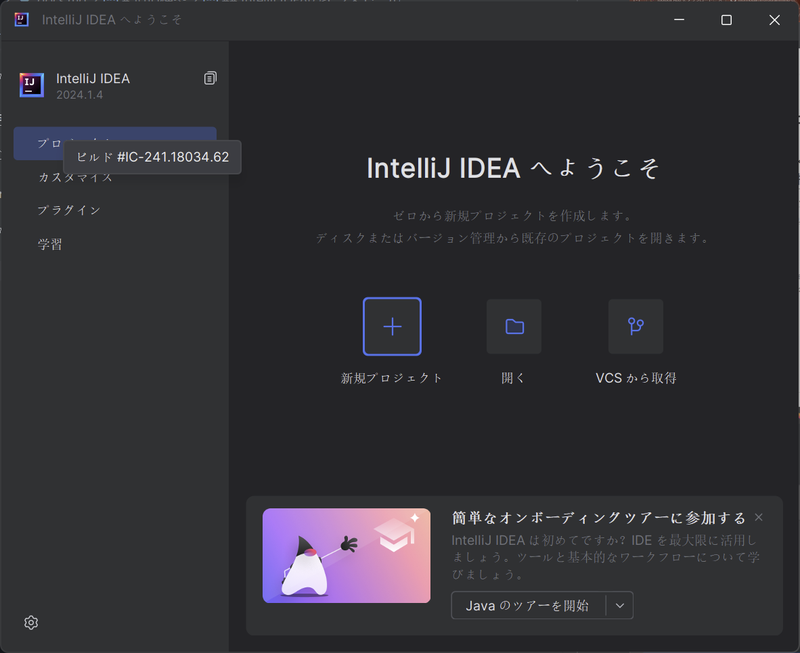
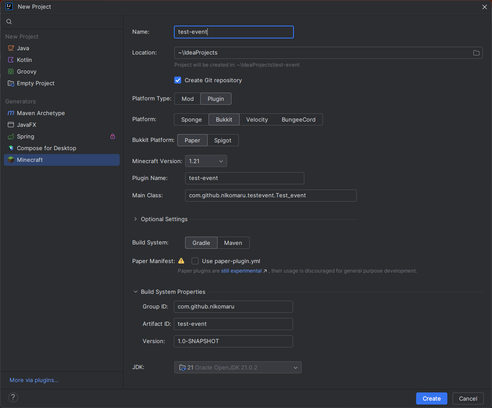

# プラグインのひな形を作ってみよう

## プロジェクトを作ってみよう

スタート画面に新規プロジェクトを押します。



新規プロジェクトを押したら、左側のジェネレーターのところにあるMinecraftを選択します。




そうしたら、それぞれのフィールドを選択していきます。

- 名前: `test-event`等好きな名前を選択してください。
-  場所: そのままで結構です。
- Platform Type: 今回はプラグインを作成するので、`Plugin`を選択してください。
- Platform : `Bukkit`を選択。
- Bukkit Platform: `paper`を選択。
- Minecraft Version: 作成したいバージョンを選択してください。今回は`1.21.3`で進めていきます。
- Plugin Name: 適当な名前を選択します。(CamelCaseで記入してください[^1])今回は`test-event`としておきます。
- Main Class: この後の入力で自動的に変化するため変更しないでください。

[^1]: CamelCaseとは、単語の区切りを大文字とするのもです。例: mechanical pencilであればMechanicalPencilとします。

次にOptional Settingというところに行きます。
- Build System: `Gradle`を選択。
- Paper Manifest: チェックなしで進めます。

その後、Build System Propertiesに進みます。

- Group ID : ドメインを逆にしたものを使います。example.comだったらcom.exampleといった形。今回はgithubのアカウントのドメインを逆にしたものを使用するため、`com.github.<userName>`とします。例: `com.github.nlkomaru`
- Artifact ID: 適当な名前を選択します。(英小文字で区切りをしたいときはハイフンを利用してください)今回は`test`としておきます。
- Version: そのままでかまいません。

最後にJDKというところをの設定をします。クリックをしていただくとJDKのダウンロードという項目が出てきます。そこを押していただき、出てきたポップアップの、
- バージョン: `21`
- ベンダー: `Eclipse Temurin (AdoptOpenJDK HotSpot)`
- 場所: `変更なし`

を選択しダウンロードを押します。

ダウンロードが完了したら作成ボタンを押します。

## 初期設定

プロジェクトが作成されたら、IntelliJ IDEAを開きます。
様々なファイルがあると思いますが、build.gradleを開いてください。

```diff
plugins {
    id 'java'
+   id 'xyz.jpenilla.run-paper' version "2.3.0"
+   id 'com.gradleup.shadow' version "8.3.5 "
}
```

このように、pluginsのところに、`id 'xyz.jpenilla.run-paper' version "2.3.0"`と`id 'com.gradleup.shadow' version "8.3.5 "`を追加してください。

それぞれ、`run-paper`はサーバーを起動するためのプラグインで、簡単にサーバーを起動できるようになります。

`shadow`はビルドしたjarファイルを一つにまとめるためのプラグインです。

次に、一番下に、
```groovy
tasks{
    runServer {
        minecraftVersion("1.21.3")
    }
}
```
を追加してください。